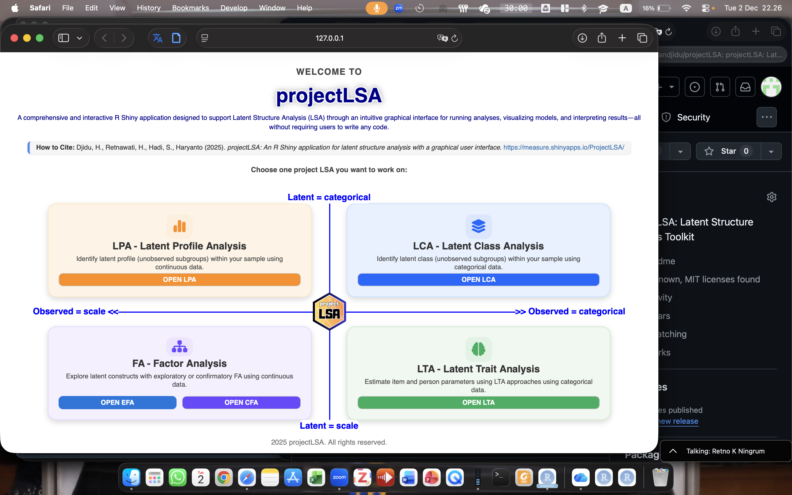

# projectLSA 

projectLSA is an R package that provides a complete graphical user
interface (GUI) for conducting **Latent Structure Analysis (LSA)**
through a Shiny application. It integrates multiple latent variable
methods, including:

- **Latent Profile Analysis (LPA)**
- **Latent Class Analysis (LCA)**
- **Latent Trait Analysis (LTA / IRT)**
- **Exploratory Factor Analysis (EFA)**
- **Confirmatory Factor Analysis (CFA)**

All analyses can be performed **without writing any code**, making the
package accessible for researchers, students, and applied analysts.

------------------------------------------------------------------------

## Installation

``` r
# Install from CRAN (when available)
install.packages("projectLSA")

# Install development version from GitHub (optional)
# remotes::install_github("hasandjidu/projectLSA")
```

------------------------------------------------------------------------

## Launch the Application

``` r
library(projectLSA)
run_app()
```

This opens the full Shiny application, including all LSA modules, data
upload, built-in datasets, interactive plots, and reporting features.

------------------------------------------------------------------------

## Features

### ✔ Latent Profile Analysis (LPA)

- Upload your own dataset or use built-in examples.
- Fit multiple LPA models automatically.
- Compare AIC, BIC, entropy, and class size.
- Visualize the best model with customizable class names.

### ✔ Latent Class Analysis (LCA)

- Supports categorical indicators.
- Fits multiple class solutions.
- Interactive plots with **ggiraph**.
- Probability tables and class membership export.

### ✔ Latent Trait Analysis (LTA / IRT)

- Supports dichotomous and polytomous items.
- Automatically fits Rasch, 2PL, 3PL (or PCM/GRM/GPCM).
- ICC plots, test information, factor scores.
- Multi-dimensional visualization with 3D surfaces and heatmaps.

### ✔ Exploratory Factor Analysis (EFA)

- KMO, Bartlett test, parallel analysis.
- Factor extraction with rotation.
- Factor scores and loading matrix export.
- Clean HTML summaries for clearer interpretation.

### ✔ Confirmatory Factor Analysis (CFA)

- Lavaan model editor.
- Fit measures, loadings, factor scores.
- Fully customized SEM path diagrams.

------------------------------------------------------------------------

## Example Screenshots

 
 

------------------------------------------------------------------------

## Citation

If you use projectLSA in publications, please cite:

Djidu, H., Retnawati, H., Hadi, S., & Haryanto (2025). *projectLSA: An R
Shiny application for latent structure analysis with a graphical user
interface.*

------------------------------------------------------------------------

## Contributing

Bug reports and feature requests are welcome:

<https://github.com/hasandjidu/projectLSA/issues>

------------------------------------------------------------------------

## License

MIT License © 2025 Hasan Djidu
